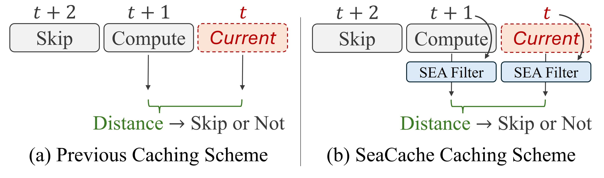

# [CVPR 2026 Oral] SeaCache: Spectral-Evolution-Aware Cache for Accelerating Diffusion Models

<h5 align="center">

[](https://arxiv.org/abs/2602.18993)
[](https://jiwoogit.github.io/SeaCache/) 


</h5>

## Method Overview
SeaCache is a training-free diffusion cache schedule that bases reuse decisions on a spectrally aligned representations. By modeling spectral evolution along the denoising trajectory, we derive a Spectral-Evolution-Aware (SEA) filter that preserves content-relevant components while suppressing noise components.

#### Practical key points:
- **No additional parameters to tune.** SeaCache introduces no additional hyperparameters (e.g., retention ratios or the coefficients). You just apply the scheduler-based SEA filtering and run inference.
- **Minimal overhead.** SEA filtering (including FFT/iFFT) is inexpensive yet highly effective, accounting only ~0.2% to total inference latency.
- **Compatibility.** SeaCache is compatible with orthogonal acceleration techniques, such as efficient attention and block-wise caching.


<p align="center">
  
</p>
<p align="center">
  <b>Figure 1:</b> Conceptual illustration of SeaCache. SeaCache applies timestep-aligned, frequency-aware filtering to guide cache scheduling, achieving strong acceleration with negligible overhead.
</p>

## Latest News
- [2026-02-26] Support [Wan2.1](https://github.com/Wan-Video/Wan2.1), [HunyuanVideo](https://github.com/Tencent-Hunyuan/HunyuanVideo), and [FLUX](https://github.com/black-forest-labs/flux).
- [2026-02-21] Released the [paper](https://arxiv.org/abs/2602.18993), [code](https://github.com/jiwoogit/SeaCache), and [project page](https://jiwoogit.github.io/SeaCache/) of SeaCache.

## Supported Models
ComfyUI support is planned for a future update.
#### Text-to-Video
- [Wan2.1](./Wan2.1/README.md)
- [HunyuanVideo](./HunyuanVideo/README.md)

#### Image-to-Video
- [Wan2.1](./Wan2.1/README.md)

#### Text-to-Image
- [FLUX](./FLUX/README.md)

## Community Contributions
- More open-source model support will be added over time.
- If you use SeaCache in your project and want it listed here, contact us at `jiwoo.jg@gmail.com`.

## Acknowledgement
This repository is built on top of [TeaCache](https://github.com/ali-vilab/TeaCache), [VBench](https://github.com/Vchitect/VBench), [Wan2.1](https://github.com/Wan-Video/Wan2.1), [Diffusers](https://github.com/huggingface/diffusers), [HunyuanVideo](https://github.com/Tencent/HunyuanVideo), and [FLUX](https://github.com/black-forest-labs/flux).
We thank the authors and contributors for their efforts.

## Citation
If SeaCache is useful for your research or applications, please consider starring this repository and citing:

```bibtex
@inproceedings{chung2026seacache,
  title={SeaCache: Spectral-Evolution-Aware Cache for Accelerating Diffusion Models},
  author={Chung, Jiwoo and Hyun, Sangeek and Lee, MinKyu and Han, Byeongju and Cha, Geonho and Wee, Dongyoon and Hong, Youngjun and Heo, Jae-Pil},
  booktitle={Proceedings of the IEEE/CVF Conference on Computer Vision and Pattern Recognition},
  pages={14283--14294},
  year={2026}
}
```
